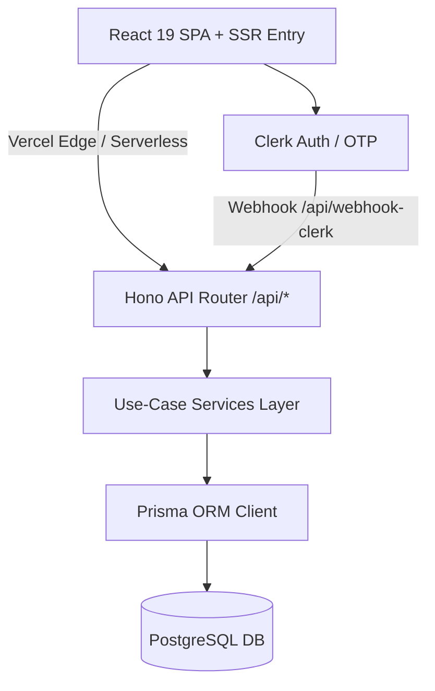

# Product Requirements Document (PRD)

**Product Name:** Catchingjobs (CatchingJobs.co.uk)  
**Operating Entity:** Pullum Ltd (UK GLAA Licensed Gangmaster & Poultry Harvesting Specialist)  
**Status:** Live / Active Development  
**Last Updated:** August 2026  

---

## 1. Executive Summary & Vision

Catchingjobs is a UK agricultural recruitment and workforce operations platform connecting qualified poultry harvesting operatives and squad leaders with commercial catching crews across England and the UK agricultural corridors.

The platform bridges high-intent organic local search traffic with a seamless, compliance-hardened onboarding pipeline and an operational administration hub for Pullum Ltd dispatchers and coordinators.

### Key Objectives
1. **Zero-Friction Candidate Acquisition**: High-converting, mobile-first triage with 1-Click Fast Apply for returning employees and passwordless OTP verification for new applicants.
2. **Localized Organic SEO Dominance**: High-ranking dynamic town and regional landing pages with server-side rendered JSON-LD `JobPosting` structured schema.
3. **End-to-End Operational Control**: Full-width administrative CRM, Kanban pipeline, dynamic job posting management, and location content management.
4. **GLAA & Lantra Compliance**: Automated Right to Work verification, biometric and NI tracking, emergency contact recording, and safety induction declarations.

---

## 2. User Personas & Core Journeys

### 2.1 The Agricultural Operative (Worker / Candidate)
- **Profile**: Night shift worker seeking stable weekly income, guaranteed door-to-door transit, and supportive squad culture.
- **Key Needs**: Fast mobile apply, clear weekly pay figures (Friday payroll), transparent pickup locations, zero login friction when returning.
- **Core Journey**:
  1. Searches organic Google for *"chicken catching jobs Boston"* or *"poultry harvesting Norfolk"*.
  2. Lands on SSR Town Hub (e.g. `/chickens/boston`) or National Directory (`/`).
  3. Completes above-the-fold Right to Work triage:
     - **If Guest**: Verifies via Clerk Passwordless Email OTP.
     - **If Authenticated**: 1-Click Fast Apply instantly claims roster slot and opens `/employee?applied=true`.
  4. Completes 3-step compliance induction (address, emergency contact, banking details, medical declaration).
  5. Views active squad assignment, pickup schedule, and Friday payroll statements in the Employee Portal.

### 2.2 The Squad Leader / Senior Driver
- **Profile**: Experienced operative leading a 6-8 person harvesting team and coordinating the minibus transport.
- **Key Needs**: Clear squad manifests, door-to-door pickup route visibility, direct dispatch communication.

### 2.3 The Dispatcher & Recruiter (Pullum Ltd Admin)
- **Profile**: Internal recruitment coordinator and operations manager.
- **Key Needs**:
  - Live Kanban applicant tracking (excluding draft drop-offs).
  - Full-width CRM and candidate inspection modal with quick-status actions (`NEW`, `REVIEWING`, `APPROVED`, `HIRED`, `REJECTED`).
  - Job vacancy creation, editing, and status toggling (`/admin/jobs`).
  - Town SEO localized copy editor (`/admin/locations`).

---

## 3. System Architecture & Tech Stack

### 3.1 Frontend Stack
- **Framework**: Vite + React 19 with TypeScript.
- **SSR Engine**: Express/Vite SSR pipeline (`src/entry.server.tsx`) for pre-rendering full HTML and metadata for web crawlers.
- **Design Systems**:
  - **Public Landers**: Hallmark anti-AI-slop design system using OKLCH color tokens (`--color-paper`, `--color-ink`, `--color-rule`, `--color-accent`).
  - **Dashboards & Portals**: Official `shadcn/ui` components (`@/components/ui/`) with standard CSS variables (`--background`, `--foreground`, `--card`, `--sidebar`).
- **Icons**: `lucide-react`.

### 3.2 Backend Stack
- **Framework**: Hono mounted across modular `/api/*` serverless routes.
- **Service Layer**: Pure domain use-case classes in `src/services/` (`ManageApplications`, `ManageJobPostings`, `ManageLocations`, `ManageUsers`).
- **Exceptions**: Custom domain exceptions (`DomainError`, `RightToWorkRequiredError`, `ApplicationNotFoundError`, `ValidationError`, `ForbiddenError`).

### 3.3 Database & Authentication
- **ORM**: Prisma ORM v7 with `@prisma/adapter-pg`.
- **Database**: PostgreSQL with connection pooling.
- **Authentication**: Clerk (Passwordless Email/SMS OTP, Google OAuth SSO, and authenticated session tokens).

---

## 4. Feature Specifications

### 4.1 Job Vacancy Management & Multi-Page Feeds
- **Admin Job Management (`/admin/jobs`)**:
  - Create, view, edit (`PUT /api/admin/job-postings/:id`), toggle status (`PATCH /api/admin/job-postings/:id`), and delete vacancies.
  - Form fields: Title, Sector (`chicken` | `turkey`), Town Depot, Pay Rate, Shift Type, Description, Requirements, Benefits.
- **Public Jobs API (`GET /api/jobs`)**:
  - Supports query filters: `sector`, `townId`, `regionId`, `status`.
  - Automatically joins Town and Region metadata for public cards.
- **Multi-Page Vacancy Display**:
  - **Homepage (`/`)**: National interactive vacancy board with sector filters and deep apply links (`?jobId=...&jobTitle=...`).
  - **Sector Hubs (`/chickens`, `/turkeys`)**: Sector-specific vacancy boards.
  - **Town Landers (`/:sector/:town`)**: Town-specific active vacancies with direct scroll-to-apply interactions.
  - **Direct Job Card Links**: Every job card across the site links directly to `/jobs/:id` as well as quick modal triage.

### 4.2 Dedicated SEO Job Details Pages (`/jobs/:id`)
- **Individual Job Pages**: Dynamic server-side and client-rendered job view with full job description, shift schedule, pay rate (£750–£1,050/wk), transit hub, and requirements.
- **Schema.org Structured Data**: Generates and embeds valid `JobPosting` JSON-LD metadata (`hiringOrganization`, `baseSalary`, `jobLocation`, `employmentType`) for Google Jobs and search engine indexing.
- **Social Sharing (`JobShareModal.tsx`)**: 1-click modal to copy URL, share via WhatsApp, Twitter/X, LinkedIn, and native mobile Web Share API.
- **Integrated Application Funnel**: Direct anchor to inline triage form or 1-Click Fast Apply for logged-in workers.

### 4.3 Interactive UK Location Map (`RegionalCatchingMap.tsx`)
- **Lightweight SVG Vector Map**: Zero-dependency, 0ms instant-loading UK mainland vector map with clickable location markers for towns covered across Lincolnshire, Norfolk, Yorkshire, Shropshire, and Suffolk.
- **Clickable Location Markers**: Selecting any town displays the town area and direct 1-click links to chicken and turkey job pages.
- **Quick Town Navigator**: Fast 1-click town pills grouped across UK regions.

### 4.4 Candidate Triage & 1-Click Fast Apply
- **Hero Triage Form (`HeroTriageForm.tsx`)**:
  - Right to Work gate (blocks non-UK eligible applicants with clear notice that no visa sponsorships are available).
  - Captures full name, mobile number, email address, town, and sector.
  - **Guest Flow**: Creates draft application and triggers Clerk passwordless OTP modal.
  - **Logged-In Employee Flow**: Auto-detects Clerk session, pre-fills verified data, displays verified employee badge, submits draft, automatically claims application via `/api/triage/claim`, and navigates directly to `/employee?applied=true`.

### 4.3 3-Step Compliance & Profile Wizard (`/wizard`)
- **Step 1: Personal & Legal**: Date of birth, National Insurance number, UK driving license.
- **Step 2: Address & Emergency Contact**: Home address, postcode (for transit routing), emergency contact name and phone.
- **Step 3: Banking & Declarations**: Bank account details (for Friday payroll), physical fitness declaration, Lantra poultry welfare agreement.
- Auto-saves progress incrementally to draft application.

### 4.4 Admin Operations Hub (`/admin/*`)
- **Full-Width Canvas**: Clean 100% full-width layout with responsive tables and data cards.
- **Controlled Sidebar**: `NavMain.tsx` handles submenu expansion smoothly without flickering.
- **Center Dialog Modals**: Spacious, responsive Dialog inspectors for location details, candidate profiles, and job editing.
- **Kanban Board (`/admin/pipeline`)**: Visual drag-and-drop workflow (`NEW`, `REVIEWING`, `APPROVED`, `HIRED`, `REJECTED`) excluding unsubmitted `Draft` drop-offs.
- **Applicant Table (`/admin/applicants`)**: Filterable, searchable data table with PDF export, SMS quick dispatch, and compliance verification badges.
- **Location CMS (`/admin/locations`)**: Real-time editor for Town localized Markdown SEO copy, active crew counts, and transit hub coordinates.

### 4.5 Employee Portal (`/employee`)
- **Crew Dashboard**: Assigned squad, transit pickup point, and next shift countdown.
- **Compliance Center**: Status of Right to Work, Lantra training modules, and PPE allocation.
- **Friday Payroll History**: Downloadable wage summaries and hours logged.
- **Profile Quick-Editor**: Update phone number, emergency contacts, or bank account.

---

## 5. API Endpoint Specifications

| Method | Endpoint | Description | Auth |
| :--- | :--- | :--- | :--- |
| `GET` | `/api/ping` | Health check & system status | Public |
| `GET` | `/api/jobs` | Public live vacancy list with filters | Public |
| `GET` | `/api/locations` | All active regions and town depots | Public |
| `GET` | `/api/locations/:sector/:townId` | Localized town data and SEO copy | Public |
| `POST` | `/api/applications/draft` | Create initial draft application | Public |
| `POST` | `/api/triage/claim` | Link Clerk `userId` to draft application | Authenticated |
| `PATCH` | `/api/applications/:rosterRef/wizard` | Incremental auto-save wizard progress | Authenticated |
| `POST` | `/api/applications/:rosterRef/submit` | Finalize submission (Draft → NEW) | Authenticated |
| `GET` | `/api/portal/me` | Fetch authenticated worker profile & application | Authenticated |
| `PATCH` | `/api/portal/onboarding` | Quick update worker contact or banking info | Authenticated |
| `GET` | `/api/admin/applications` | List applications with pagination & filters | Admin |
| `PATCH` | `/api/admin/applications/:id/status` | Update applicant status in pipeline | Admin |
| `GET` | `/api/admin/job-postings` | List all job postings | Admin |
| `POST` | `/api/admin/job-postings` | Create a new job vacancy | Admin |
| `PUT` | `/api/admin/job-postings/:id` | Full update of existing job vacancy | Admin |
| `PATCH` | `/api/admin/job-postings/:id` | Partial update / toggle vacancy status | Admin |
| `DELETE` | `/api/admin/job-postings/:id` | Delete a job vacancy | Admin |
| `PUT` | `/api/admin/locations/:townId` | Update Town localized SEO Markdown copy | Admin |
| `POST` | `/api/webhook-clerk` | Clerk user lifecycle webhook synchronization | Public / Webhook |

---

## 6. Non-Functional & Quality Standards

1. **Accessibility & Usability**: Full keyboard navigation, ARIA tags on all modal dialogs and form controls, WCAG AA color contrast.
2. **Performance**: Fast LCP (<1.5s), zero cumulative layout shift (CLS) through SSR data pre-hydration.
3. **Automated Quality Gate**: `npm run quality-check` must pass before every deployment (Prettier format, ESLint 0 warnings, Vitest unit test suite, and Vite production SSR build).
