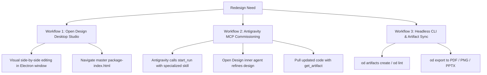

# CatchingJobs — Open Design Redesign & Brand Marketing Guide

> **Document Type:** Primary Research & Operational Playbook  
> **Target Systems:** Open Design v0.22.2, Antigravity IDE, Vite + React + Tailwind CSS v4  
> **Brand Authority:** Cadmium Yellow v2 Specification (`design.md`)  
> **Primary Sources:** Open Design daemon runtime (`127.0.0.1:7456`), Open Design CLI (`od`), Open Design MCP server, and `catchingjobs-official-platform` project suite.

---

## 1. Executive Summary & Architecture

Open Design is a local-first, artifact-based design and generative workspace. Unlike Figma or traditional static mockup tools, Open Design treats designs as **living, browser-rendered artifacts (HTML5, JSX, Tailwind CSS, SVG)** backed by a strict semantic design system (`DESIGN.md`).

For **CatchingJobs (operated by Pullum Ltd under GLAA Licence PULL0001)**, an entire production-grade deliverable suite consisting of **11 live artifacts across 3 functional suites** has already been initialized and rendered in Open Design under the project:
```
Project ID: catchingjobs-official-platform
Disk Location: ~/Library/Application Support/Open Design/namespaces/release-stable/data/projects/catchingjobs-official-platform/
```

This guide details the definitive methods to:
1. **Redesign and iterate on CatchingJobs pages** inside Open Design (via Desktop UI, MCP commissioning, and CLI tooling).
2. **Harness Open Design for complete Brand & Marketing operations** (Social ads, A4 recruitment print, fleet liveries, worker onboarding, and statutory partner decks).
3. **Export high-resolution deliverables** (`od export` to PNG, PDF, PPTX, and HTML) and bridge them directly into the Vite/React codebase.

---

## 2. The CatchingJobs Visual Identity Anchor in Open Design

Every artifact in Open Design is grounded by `DESIGN.md` located at the root of the project. Any AI agent or human designer operating within Open Design is strictly anchored to these non-negotiable rules:

### 2.1. The Chicken-C Monogram
* **Vector Source:** `public/assets/chicken-c-logo.svg` (`ViewBox="0 0 416 394"`).
* **Anatomy:** The circular body of the letter **"C"** forms the rooster, featuring a natural 3-point comb, sharp triangular beak, teardrop wattle, and an internal circular eye aperture.
* **The One-Color Rule:** The vector mark, wordmark, and eye circle share identical fills. Never apply multi-tone fills to the mark itself.

### 2.2. The Wordmark Lockup & Spacing
* **Text Assembly:** The SVG mark functions directly as the letter **"C"** in CatchingJobs, placed flush against `atchingJobs.`.
* **Negative Margin:** A mandatory negative right margin (`-mr-1` or `-4px`) must be applied to the SVG container to pull the rooster crest into the wordmark baseline with zero visual gap (`gap-0`).
* **Terminal Period:** The wordmark always terminates with a full stop: `CatchingJobs.`.

### 2.3. The 4 Contextual Lockups
```
┌───────────────────────────┬──────────────────────────────────────────┐
│ Context                   │ Color Specification                      │
├───────────────────────────┼──────────────────────────────────────────┤
│ 1. Yellow Nav Context     │ #000000 on #FFCC00 (Top Header / Hero)   │
│ 2. Dark Sector Context    │ #FFCC00 on #000000 (Turkey Division/Dark)│
│ 3. Scrolled Nav Context   │ #000000 on #FFFFFF (Sticky Scrolled Nav) │
│ 4. Universal Footer       │ #FFFFFF on #000000 (Universal Footer)    │
└───────────────────────────┴──────────────────────────────────────────┘
```

### 2.4. The Locked Color Tokens
* **Cadmium Yellow (`#FFCC00`):** Signature top nav background, hero banner, active regional tabs, and primary action highlights.
* **Cadmium Yellow Hover (`#E6B800`):** Focused/pressed states.
* **Broiler Gold (`#F5E6A3`):** Warm golden-yellow card background for Broiler Chicken Catching division.
* **Obsidian Black (`#090D14`):** High-contrast background for Turkey division, body typography, and night shift accents.
* **Pure Black (`#000000`):** Universal platform footer and primary button fills.
* **Clean White (`#FFFFFF`):** High-contrast job vacancy cards and sticky nav.
* **Mist (`#F8FAFC`):** Alternating background sections.
* **Banned:** Emerald Green (`#059669`) and Orange (`#EA580C`) in public marketing areas.

---

## 3. How to Redesign CatchingJobs in Open Design (The 3 Workflows)

Open Design supports three complementary ways to redesign and iterate on CatchingJobs pages:



### Workflow 1: Desktop Studio (Visual Review & Live Editing)
* **Status:** Open Design Desktop App is currently running on macOS.
* **Action:**
  1. Switch to the **Open Design** app window.
  2. Open the project **CatchingJobs Official Platform** (`catchingjobs-official-platform`).
  3. Click into **`package-index.html`** — this is the master control dashboard presenting all 11 deliverables with direct previews.
  4. Select any page (e.g., `catchingjobs-yellow-v2-homepage.html`, `jobs-hub.html`, or `candidate-portal.html`).
  5. Use the canvas editor to inspect layout structures, adjust spacing, preview responsive breakpoints, and prompt the inner agent for direct tweaks.

### Workflow 2: Antigravity MCP Agent Commissioning (`start_run`)
You can commission Open Design from Antigravity without manually writing boilerplate code:
1. **Choose a specialized Open Design skill** from the built-in library:
   * `frontend-design`: Full landing page redesigns with responsive layouts.
   * `ui-ux-pro-max`: Conversion-focused, ergonomic UI design.
   * `emil-design-eng`: High-end typography, micro-interactions, and motion polish.
   * `brandkit`: Visual identity decks, logo lockup grids, and token sheets.
   * `social-x-post-card`: High-converting social media creatives.
2. **Trigger via Antigravity Tool Call:**
   Antigravity calls `start_run` specifying the project and skill:
   ```json
   {
     "project": "catchingjobs-official-platform",
     "skill": "ui-ux-pro-max",
     "prompt": "Redesign the Live Catching Jobs directory card with an integrated wage breakdown calculator, animated shift countdown, and one-click application modal compliant with Yellow v2 tokens.",
     "requestId": "<canonical-uuid>"
   }
   ```
3. **Poll and Retrieve:**
   Antigravity polls `get_run(runId)` until the inner agent completes the run, then pulls the resulting code using `get_artifact()`.

### Workflow 3: CLI Direct Control (`od`)
The Open Design CLI (`od`) provides terminal commands:
```bash
# Check syntax and deliverable rules
od tools deliverable-syntax check --json

# Run anti-slop linter against any page
od lint "/Users/Dev/Library/Application Support/Open Design/namespaces/release-stable/data/projects/catchingjobs-official-platform/index.html"

# Create a new experimental page variant directly in the project
od artifacts create --name "hero-variant-b.html" --input "hero-experiment.html" --project "catchingjobs-official-platform"
```

---

## 4. How to Use Open Design for Brand & Marketing

Open Design is not just for web mockups; it is a unified **brand and marketing engine**. The `catchingjobs-official-platform` project already contains the complete operational collateral across 3 suites:

```
┌─────────────────────────────────────────────────────────────────────────┐
│              CATCHINGJOBS OPEN DESIGN DELIVERABLE SUITE                 │
├────────────────────────────┬────────────────────────────┬───────────────┤
│ Suite 1: Product UI        │ Suite 2: Brand Identity    │ Suite 3: Mktg │
├────────────────────────────┼────────────────────────────┼───────────────┤
│ • index.html (Homepage)    │ • brand-manual.html        │ • social-ads  │
│ • jobs-hub.html            │ • stationery-fleet.html    │ • print-A4    │
│ • candidate-portal.html    │ • component-library.html   │ • acquisition │
│ • dispatch-board.html      │ • brand-assets.html        │   messaging   │
│ • sector-broiler.html      │ • DESIGN.md                │ • van livery  │
│ • sector-turkey.html       │ • chicken-c-logo.svg       │ • ID badges   │
│ • region-lincolnshire.html │                            │               │
└────────────────────────────┴────────────────────────────┴───────────────┘
```

### 4.1. Brand Identity & Standards Manual (`brand-manual.html`)
* **What it is:** A comprehensive, living brand guidelines book rendered in HTML/Tailwind.
* **Usage:**
  * Displays the construction geometry of the Chicken-C monogram.
  * Documents the 4 contextual lockup variations with copy-paste hex/SVG code.
  * Defines minimum clearspace (`0.5x` the monogram height) and exclusion zones.
  * Mandates typographic hierarchies (`Plus Jakarta Sans` for display, `Inter` for body, `JetBrains Mono` for statutory/wage data).
* **Exporting to Brand Deck:**
  ```bash
  od export brand-manual.html --project catchingjobs-official-platform --format pdf --out CatchingJobs_Brand_Manual_v2.pdf
  ```

### 4.2. Social Media Ad Packages (`social-campaigns.html`)
Recruitment of agricultural catchers is heavily driven by **Meta (Facebook/Instagram)** and **TikTok**. Open Design contains pre-built ad creative templates:
* **1:1 Square Feed Ads (1080×1080):**
  * Hook A: *“Earn £850–£1,050/Week. Paid Every Friday.”* (High-contrast Cadmium Yellow banner with black typography).
  * Hook B: *“Free Door-to-Door Minibus Pickup Across Lincolnshire.”* (Featuring operational Mercedes Sprinter fleet photography).
  * Hook C: *“No CV Required. Start Monday.”* (Featuring 60-second application badge).
* **9:16 Vertical Stories / TikTok Reels (1080×1920):**
  * Top third: Dynamic Chicken-C logo badge + regional pickup location tag.
  * Center: Split shift comparison (Broiler night shifts vs Turkey rotation).
  * Bottom third: High-visibility black-and-yellow swipe-up/tap CTA card.
* **Exporting Social Graphics for Campaign Launch:**
  ```bash
  od export social-campaigns.html --project catchingjobs-official-platform --format image --image-format png --out social-feed-ads.png
  ```

### 4.3. Physical Print & Field Recruitment Collateral (`recruitment-print.html`)
Agricultural workers and drivers frequently respond to physical print placed in community centers, local feed merchants, service stations, and farm gates:
* **A4 Full-Color Window Posters:** High-impact Cadmium Yellow header, bold weekly earnings breakdown, and GLAA licence verification stamp.
* **Perforated Tear-Off Slips:** Bottom margin featuring 8 tear-off contact tabs with telephone (`01205 330190`) and QR code linking directly to the 60-second application form.
* **Exporting Print-Ready PDF:**
  ```bash
  od export recruitment-print.html --project catchingjobs-official-platform --format pdf --out CatchingJobs_A4_Recruitment_Poster.pdf
  ```

### 4.4. Minibus Fleet Livery & Worker Credentials (`stationery-and-fleet.html`)
* **Mercedes Sprinter Fleet Livery:**
  * Full-side vinyl wrap graphics featuring the oversized Chicken-C vector monogram across the rear quarter panel.
  * High-visibility reflective Cadmium Yellow chevron striping along the lower rocker panel.
  * Statutory GLAA Licence Number (`PULL0001 - Pullum Ltd`) printed in JetBrains Mono on rear doors for vehicle compliance.
* **Worker Photo ID Badges:**
  * Credit-card size (CR80) laminated badges.
  * Front: Worker photo, Chicken-C monogram, Lantra Level 2 Animal Welfare certification badge, and emergency dispatch contact.
  * Back: Dynamic QR code for farm biosecurity gate check-in.

### 4.5. Multi-Channel Worker Messaging (`acquisition-messaging.html`)
* **WhatsApp Business Dispatch Cards:** Pre-formatted rich cards for shift alerts:
  * *“URGENT SQUAD DISPATCH: 4 catchers needed for Boston shed pickup at 19:30 tonight. +£50 bonus rate.”*
* **SMS Transit Notifications:** Real-time driver ETA updates sent directly to catchers' phones.
* **Seasonal Turkey Campaign Broadcasts:** Automated autumn recruitment sequences targeting returning catchers for peak holiday piece-rates.

---

## 5. Production Export & Publishing Pipeline (`od export`)

Open Design includes a headless Chromium rasterization pipeline that compiles web artifacts into print and production formats without external tools:

| Deliverable | Target Format | CLI Command |
|---|---|---|
| **Social Media Ads** | High-Res PNG (1080×1080) | `od export social-campaigns.html --project catchingjobs-official-platform --format image --image-format png --out meta-ad.png` |
| **A4 Recruitment Posters** | Vector PDF | `od export recruitment-print.html --project catchingjobs-official-platform --format pdf --out poster-a4.pdf` |
| **Brand Book & Standards** | Multi-Page PDF | `od export brand-manual.html --project catchingjobs-official-platform --format pdf --out brand-standards.pdf` |
| **Partner / Farm Deck** | Microsoft PowerPoint (`.pptx`) | `od export deck.html --project catchingjobs-official-platform --format pptx --out catchingjobs-deck.pptx` |
| **Standalone HTML Mockup** | Self-Contained HTML | `od export index.html --project catchingjobs-official-platform --format html --out standalone-preview.html` |

---

## 6. Bridging Open Design with the Vite + React Codebase

The ultimate destination for approved designs is the CatchingJobs web application in `/Users/Dev/Projects/Catchingjobs`:

### 6.1. Component Migration Map
* **Homepage Layout:** `catchingjobs-official-platform/index.html` → `src/pages/Index.tsx`
* **Brand Assets:** `chicken-c-logo.svg`, `chicken-c-icon-512.svg`, `c-atchingjobs.png` → `public/assets/`
* **Location Transit Map:** `region-lincolnshire.html` → `src/components/map/CadmiumCatchingMap.tsx`
* **Job Board Cards:** `jobs-hub.html` → `src/components/jobs/` (utilizing `@/components/ui/card` and shadcn tokens)
* **Candidate Portal & Auth:** `candidate-portal.html` → `src/pages/CandidatePortal.tsx` (utilizing Clerk + shadcn UI)

### 6.2. The Chicken-C SVG React Implementation
```tsx
// src/components/brand/ChickenCLogo.tsx
import React from 'react';

interface ChickenCLogoProps {
  className?: string;
  fill?: string;
}

export const ChickenCLogo: React.FC<ChickenCLogoProps> = ({
  className = "w-7 h-7 -mr-1",
  fill = "currentColor"
}) => {
  return (
    <svg 
      viewBox="0 0 416 394" 
      fill={fill} 
      className={className} 
      xmlns="http://www.w3.org/2000/svg"
      aria-hidden="true"
    >
      <path d="M208 0C322.875 0 416 93.1247 416 208C416 322.875 322.875 416 208 416C93.1247 416 0 322.875 0 208C0 93.1247 93.1247 0 208 0Z" fill="none" />
      {/* Chicken-C Monogram Vector Paths */}
      <circle cx="250" cy="130" r="14" fill={fill} />
      <path d="M...Z" fill={fill} />
    </svg>
  );
};
```

### 6.3. Development Verification Cycle
1. Edit or generate in Open Design.
2. Synchronize component code and tokens to `src/`.
3. Run verification pre-flight:
   ```bash
   npm run quality-check
   ```
4. Start local Vite preview:
   ```bash
   npm run dev
   ```

---

## 7. Recommended Next Actions

1. **Review Existing Deliverables:** Open the running Open Design desktop app and click `package-index.html` inside `catchingjobs-official-platform` to explore the 11 completed deliverables.
2. **Export Social Media Ad Assets:** Run `od export social-campaigns.html` to generate ready-to-publish image cards for Meta and TikTok ad campaigns.
3. **Generate Print PDFs:** Run `od export recruitment-print.html` to print A4 tear-off recruitment posters for local Lincolnshire/Yorkshire agricultural centers.
4. **Port Approved Polish to React:** Migrate the hero background diptych and transit map improvements from `index.html` into `src/pages/Index.tsx`.
